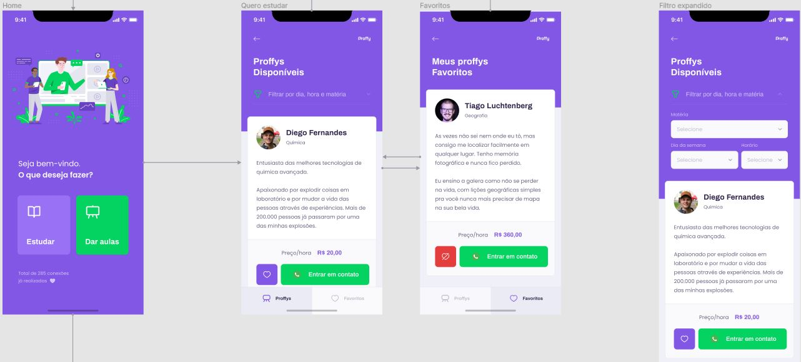

<h1 align="center">
    
</h1>

## Descrição

Projeto desenvolvido no Next Level Week #2 visando o Dia Nacional dos Profissionais da Educação (06/08/2020).

A plataforma idealizada, Proffy, tem como objetivo conectar alunos que desejam aprimorar seus conhecimentos em alguma matéria com professores dispostos a ensinar.

Os professores poderão se cadastrar na plataforma web com algumas informações básicas:

- Nome completo
- Avatar
- WhastApp
- Biografia
- Matéria
- Custo da hora/auça
- Horários disponíveis

Os alunos poderão se conectar com os professores cadastrados da seguinte forma:

- Navegando na página de "estudar" utilizando os filtros:
  - Matéria
  - Dia da semana
  - Hora
- Clicando em "Entrar em contato" no card do professor desejado, no qual será redirecionado para o whatsapp

## Layout 

Layout criado por Tiago Luchtenberg (@tiagoluchtenberg) e disponibilizado via Figma.

### Web

<a href="https://www.figma.com/file/GHGS126t7WYjnPZdRKChJF/Proffy-Web?node-id=0%3A1">
  
</a>

<p align="center">
  
</p>

### Mobile

<a href="https://www.figma.com/file/e33KvgUpFdunXxJjHnK7CG/Proffy-Mobile?node-id=0%3A1">
  
</a>

<p align="center">
  
</p>

## Stack

- React
- React Native
- Node.js
- Typescript
- SQLite

## Estrutura do projeto

O projeto está dividido em 3 (três) diretórios:

- Back End (./api)
- Front End (./web)
- Mobile (.mobile)

### Ambiente

Necessário instalação prévia das ferramentas:

- Yarn
- Expo

### Executando o Back End (./api)

```bash
# Instalação de dependências
$ yarn install

# Execução de migrations para criação do banco
yarn knex:migrate

# Executando a aplicação
$ yarn start

# Servidor será iniciado em http://localhost:3333 
```

### Executando aplicação web (./web)

```bash
# Instalação de dependências
$ yarn install

# Executando a aplicação
$ yarn start

# Aplicação ficará acessível em http://localhost:3000
```

### Executando aplicação mobile (./mobile)

```bash
# Instalação de dependências
$ yarn install

# Executando a aplicação
$ yarn start

# Navegador será aberto no Expo Developer Tools com as instruções de acesso
```

